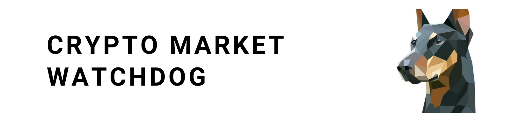

---
[](https://github.com/Huseyinnurbaki/crypto-watchdog/actions/workflows/main.yml)
# Crypto Watchdog is a free crypto market observer. 
Queries first 200 coins/tokens every 45 minutes & returns the ones increased or decreased more than %10 in an hour & notifies google chat room & Slack Channel or your services.

- www.coingecko.com (default)
- www.coinmarketcap.com (optional)


# Environment Variables :globe_with_meridians:	

|  Name | Mandatory  | Description |
|---|---|---|
| CMC_PRO_API_KEY  | False  | Enables coinmarketcap queries   |
| GOOGLE_CHAT_ROOM_HOOK  | True  | Notifies Google chat room. Enables Google chat notifications.    |
| SLACK_CHANNEL_HOOK  | False  |  Notifies Slack channel. Enables Slack Channel notifications.  |
| CUSTOM_CHANNEL_HOOK  | False  |  Feeds provided rest endpoint. Enables Custom notifications.  |
| HOURLY_PERCENTAGE  | False  | Used to filter price increase percentage in an hour, default is 10%  |
| DAILY_PERCENTAGE  | False  | Used to filter price increase percentage in a day, inactive if not defined  |

> Api token (CMC_PRO_API_KEY) can be obtained from https://coinmarketcap.com/api/ . (I am using Free version)
- Provide at least one HOOK to get notified.
- Features activated by passed environment varibles. You can have all features together or individually.
- Checkout [Integration Document](https://github.com/Huseyinnurbaki/crypto-watchdog/wiki/Custom-Hook-Integration) for custom hook integration.
# Quickstart 🚀

> Quickstart without cloning the repoistory.

- Add your environment variables to the following command.

### Docker (Alternative 1)
```console
$ docker run -d --env CMC_PRO_API_KEY=<YOUR_KEY> --env GOOGLE_CHAT_ROOM_HOOK=<YOUR_HOOK> --env SLACK_CHANNEL_HOOK=<YOUR_HOOK> --env HOURLY_PERCENTAGE=12 hhaluk/crypto-watchdog
```

All set. :white_check_mark:	

### Kubernetes (Alternative 2)
- Copy [standard-deployment.yaml](https://github.com/Huseyinnurbaki/crypto-watchdog/blob/master/k8s/standard-deployment.yaml) on your machine & place your environment variables if required.
(otherwise remove unused name/value pairs)

```console
$ kubectl apply -f standard-deployment.yaml
```

All set. :white_check_mark:	
# Upcoming :construction:	

- Telegram Webhook
- Discord Webhook
- New Coin Listings

# Development :hammer_and_wrench:	

- Clone the repository
- Create an .env file under the root directory & place your Environment Varibles inside the .env. :warning: 

```console
$ npm i
$ npm run start:debug
```
# References

- [Changelog](https://github.com/Huseyinnurbaki/crypto-watchdog/blob/master/changelog.md)

# Licence

- Crypto Watchdog is [MIT Licensed](https://github.com/Huseyinnurbaki/mocktail/blob/master/changelog.md)
