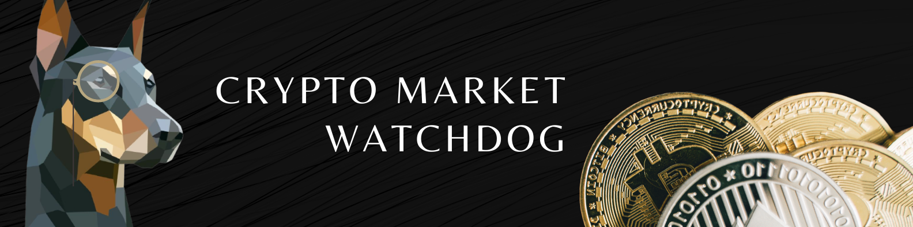

---
[](https://github.com/Huseyinnurbaki/crypto-watchdog/actions/workflows/main.yml)


# Crypto Watchdog is open-source containerized crypto market observer service.
Finds new listed coins every hour and Queries coins/tokens every 45 minutes & returns the ones increased or decreased more than %10 in an hour & notifies google chat room & Slack Channel & Telegram or your services. 

### Providers
- www.coingecko.com (default)
- www.coinmarketcap.com (optional)
- www.bitquery.io (optional)

# Quickstart 🚀

> Quickstart without cloning the repoistory.

- Add your [environment variables](#environment-variables) to the following command. 

> Image tag "latest" is not a stable tag.
> Always run the image with a specific semantic version tag. See Releases section to find version tags.

### Docker (Alternative 1)

```console
$ docker run -d \
    --env CMC_PRO_API_KEY=<YOUR_KEY> \
    --env GOOGLE_CHAT_API_URL=<YOUR_HOOK> \
    --env SLACK_API_URL=<YOUR_HOOK> \
    --env HOURLY_PERCENTAGE=12 \
    --env TELEGRAM_API_URL=<YOUR_HOOK> \
    hhaluk/crypto-watchdog:0.4.1
```

> Tip: include parse_mode=markdown at the end of your dynamic Telegram Url.
> https://api.telegram.org/botXXXXXXX:XXXXXXXXXXXXXXXX/sendMessage?chat_id=XXXXXXXXXXXX&parse_mode=markdown

All set. :white_check_mark:	

### Kubernetes (Alternative 2)
- Copy [standard-deployment.yaml](https://github.com/Huseyinnurbaki/crypto-watchdog/blob/master/k8s/standard-deployment.yaml) on your machine & place your environment variables if required.
(otherwise remove unused name/value pairs)

```console
$ kubectl apply -f standard-deployment.yaml
```

## Environment Variables

|  Name | Mandatory  | Requires | Description |
|---|---|---|---|
| CMC_PRO_API_KEY  | False | - | Enables coinmarketcap queries.   |
| BITQUERY_API_KEY  | False | - | Enables bitquery queries. Returns new listed coins.   |
| GOOGLE_CHAT_API_URL  | True | - | Notifies Google chat room. Enables Google chat notifications.    |
| SLACK_API_URL  | False | - |  Notifies Slack channel. Enables Slack Channel notifications.  |
| TELEGRAM_API_URL  | False | - |  Notifies Telegram channel. Enables Telegram Channel notifications.  |
| CUSTOM_CHANNEL_HOOK  | False | - |  Feeds provided rest endpoint. Enables Custom notifications.  |
| HOURLY_PERCENTAGE  | False | - | Used to filter price increase percentage in an hour, default is 10%.  |
| DAILY_PERCENTAGE  | False | - | Used to filter price increase percentage in a day, inactive if not defined.  |
| COIN_GECKO_PAGE_LIMIT  | False  | - | Used to change number of pages to query, default is 2. min: 1 max:28.  |
| BITQUERY_NEW_LISTED_BSC_COINS_ENABLED  | False | BITQUERY_API_KEY | Enables new listed BSC coins notifications.   |
| BITQUERY_NEW_LISTED_ETH_COINS_ENABLED  | False | BITQUERY_API_KEY | Enables new listed Eth coins notifications.   |

---
- Api token (CMC_PRO_API_KEY) can be obtained from https://coinmarketcap.com/api/ . (I am using Free version)
- Api token (BITQUERY_API_KEY) can be obtained from https://graphql.bitquery.io/ide . (I am using Developer (free) version)
- Provide at least one HOOK to get notified.
- Features activated by passed environment varibles. You can have all features together or individually.
- Checkout [Integration Document](https://github.com/Huseyinnurbaki/crypto-watchdog/wiki/Custom-Hook-Integration) for custom hook integration.


All set. :white_check_mark:	
# Upcoming :construction:	

- Discord Webhook
- New Coin Listings

# Development :hammer_and_wrench:	

- Clone the repository
- Create an .env file under the root directory & place your Environment Varibles inside the .env. :warning: 

```console
$ npm i
$ npm run start:debug
```

# References

- [Changelog](https://github.com/Huseyinnurbaki/crypto-watchdog/blob/master/changelog.md)
- [Known Issues](https://github.com/Huseyinnurbaki/crypto-watchdog/projects/1#column-14351402)

# Licence

- Crypto Watchdog is [MIT Licensed](https://github.com/Huseyinnurbaki/mocktail/blob/master/changelog.md)
